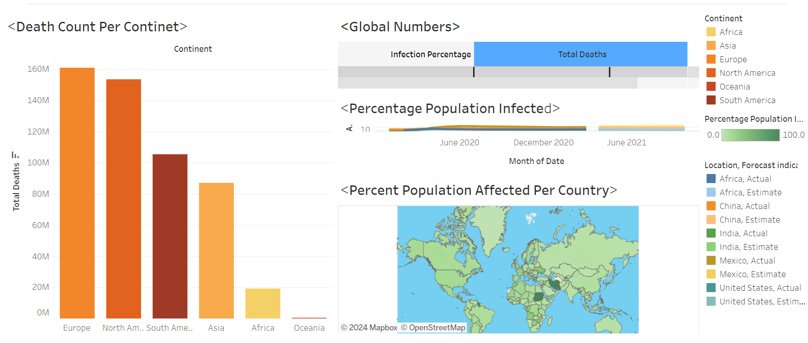

# COVID Data Analysis Project

This project analyzes COVID-19 data, focusing on deaths and vaccination rates against the population. It includes SQL scripts for data manipulation, analysis, and tableau visualization.
## Dashboard Image

## Introduction

The COVID-19 pandemic has profoundly impacted global health systems and societies. This project aims to provide insights into COVID-19 deaths and vaccination rates, helping stakeholders make informed decisions.

## Project Structure

- `scripts/`: Contains SQL scripts for data manipulation and analysis.

## Tableau Visualizations

The Tableau visualizations included in this project offer a comprehensive view of COVID-19 data, highlighting trends in deaths and vaccination rates. These visualizations are instrumental in understanding the impact of the pandemic and guiding decision-making processes.
